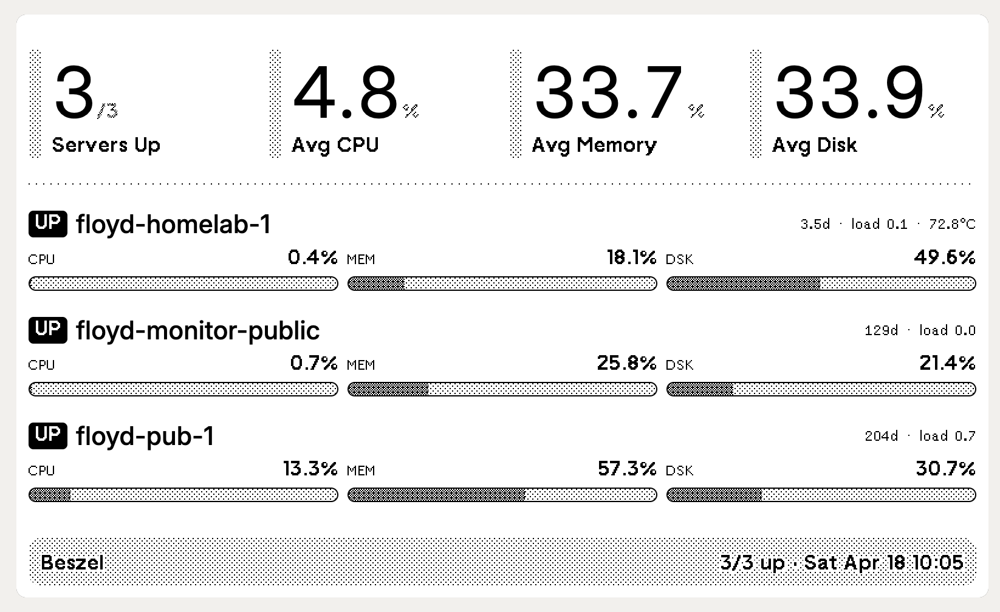

# trmnl-beszel

A [TRMNL](https://usetrmnl.com) e-ink plugin that shows your [Beszel](https://beszel.dev) server fleet at a glance — CPU, memory, disk, uptime, load average, and temperature for every host you monitor.



## What it does

A small Python script polls your Beszel hub every 5 minutes, transforms the latest stats into a compact JSON payload, and pushes it to a TRMNL Private Plugin via webhook. TRMNL renders the supplied [Liquid template](template.liquid) into a 1‑bit BMP and your device picks it up on its next refresh.

```
[ supercronic ] -> [ push.py ] -> [ Beszel API ] -> [ TRMNL webhook ] -> [ device ]
```

No data leaves your network except the rendered payload (servers' names, percentages, uptime). Beszel credentials stay in a local `.env`.

## Requirements

- A [TRMNL](https://usetrmnl.com) device (Private Plugins work on every TRMNL plan)
- A running [Beszel](https://beszel.dev) hub with at least one agent reporting
- Docker + Docker Compose, **or** Python 3.11+ if you'd rather run the script directly

## Setup

### 1. Create the TRMNL Private Plugin

In your TRMNL account, go to **Plugins → Private Plugin → New** and choose:

| Field | Value |
| --- | --- |
| Strategy | **Webhook** |
| Name | `Beszel Servers` (or whatever you like) |
| Framework CSS version | latest (v3+) |
| Remove bleed margin | No |
| Dark mode | No |

Save. The plugin's edit page now exposes a **Webhook URL** that looks like `https://trmnl.com/api/custom_plugins/<UUID>` — copy it.

### 2. Paste the markup

On the same page, click **Edit Markup → Full**, paste the contents of [`template.liquid`](template.liquid), Save. Hit **Preview** — at first it'll be empty; once the script pushes once it'll show real data.

### 3. Configure

```bash
cp .env.example .env
$EDITOR .env
```

```
BESZEL_URL=https://beszel.example.com   # your Beszel hub
BESZEL_EMAIL=you@example.com            # a Beszel user with read access
BESZEL_PASSWORD=...                     # password
TRMNL_WEBHOOK_URL=https://trmnl.com/api/custom_plugins/<UUID>
TZ=Asia/Kolkata                         # timezone for the timestamp on the card
```

### 4. Run

**With Docker (recommended)** — runs every 5 minutes via supercronic:

```bash
docker compose up -d
docker compose logs -f
```

You should see `ok: N/M up, payload XXXB @ HH:MM` lines on each cron tick.

**Without Docker** — wire `python3 push.py` into your scheduler of choice (cron, systemd timer, launchd):

```bash
set -a; . ./.env; set +a
python3 push.py
```

The script has zero dependencies beyond Python's standard library.

## Customization

- **Refresh cadence** — edit [`crontab`](crontab). Default is `*/5`. TRMNL's free tier rate-limits to 12 webhook posts per hour (every 5 min); TRMNL+ allows 30/hour.
- **Layout** — [`template.liquid`](template.liquid) uses TRMNL Framework v3 classes (`progress-bar`, `divider`, `flex--between`, etc.). All classes are documented at [trmnl.com/framework/docs/v3](https://trmnl.com/framework/docs/v3). Tweak directly in the TRMNL UI; your changes are saved server-side.
- **Other view sizes** — the template targets `view--full` (800×480). Add `half_horizontal`, `half_vertical`, or `quadrant` views in the TRMNL markup editor if you want this plugin to share screen space with other plugins.
- **Payload size** — the JSON push is capped at 2 KB by TRMNL. The script uses short keys (`n`, `s`, `cpu`, `mem`, `dsk`, `up`, `la`, `t`) to keep room for ~30 servers. If you exceed the cap you'll see a warning on stderr.

## How the data is transformed

Beszel's `systems` collection embeds the latest snapshot in a record's `info` field, so a single `GET /api/collections/systems/records` covers everything we display — no need to query `system_stats` rollups. The script picks out:

| Beszel key | Card field |
| --- | --- |
| `cpu` | CPU % |
| `mp` | Memory % |
| `dp` | Disk % |
| `u` | Uptime (formatted as `Xh` / `X.Xd` / `Xd`) |
| `la[0]` | 1‑min load average |
| `dt` | Dashboard temperature (°C) |
| `t` | Thread count (sent but currently unused on the card) |

## Troubleshooting

- **`trmnl error 403` with a Cloudflare error** — your User-Agent was rejected. The script sends `beszel-trmnl/1.0`; if you fork and rename, keep some identifying UA.
- **`beszel error 400/401`** — Beszel uses PocketBase auth. Confirm the email + password against `https://<your-beszel>/_/`. Superusers and regular users both work; a dedicated read-only user is cleanest.
- **`ok` lines but device doesn't update** — TRMNL devices refresh on their own cadence (set per-device on `https://usetrmnl.com/devices`). Use the **Preview** button on the plugin page to confirm the markup renders.
- **Payload >2 KB warning** — too many servers; trim with `?filter=...` in `beszel_systems()` or shorten the displayed names.

## License

MIT. See [LICENSE](LICENSE).
